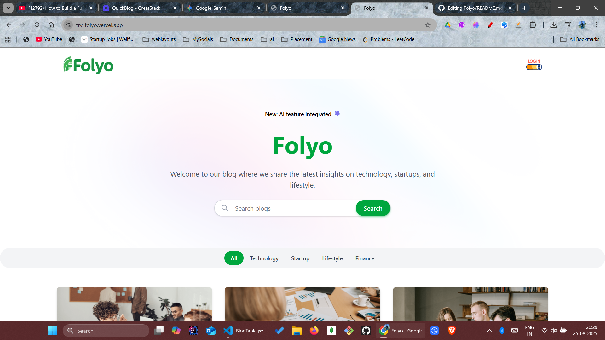
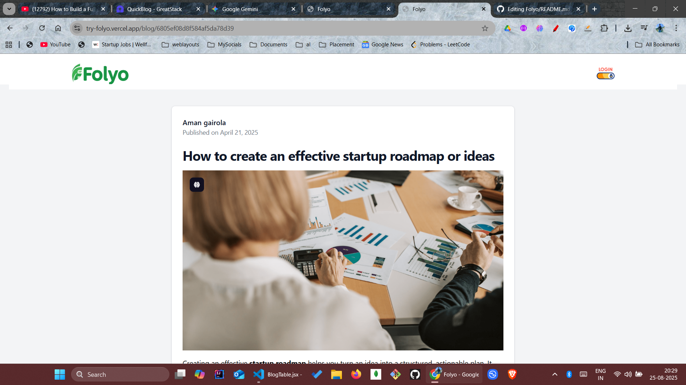
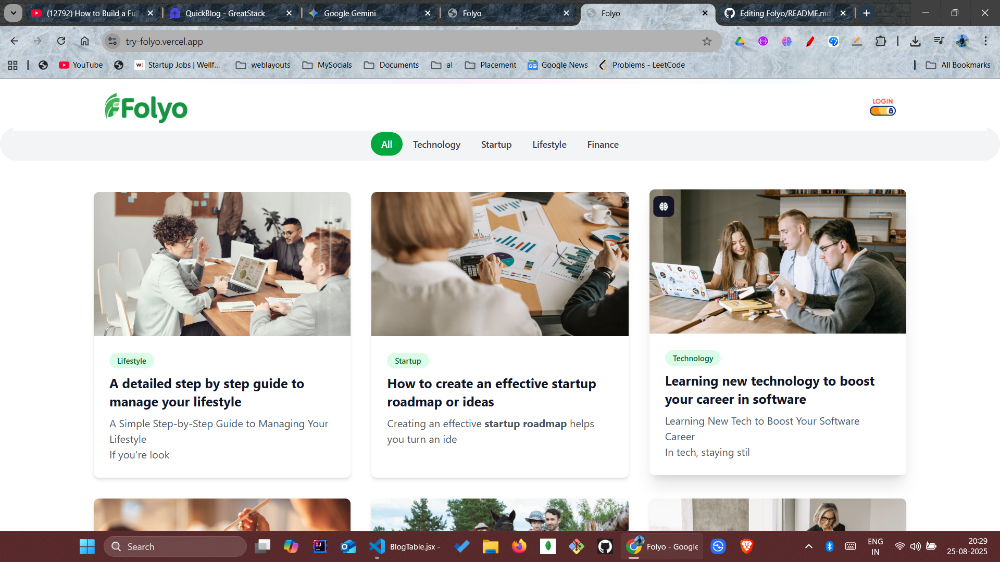
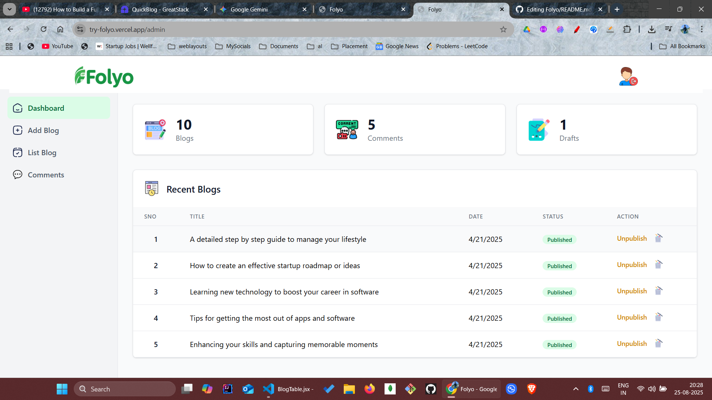

# Folyo - A Modern Full-Stack Blog Platform 📝

Folyo is a clean, responsive, and feature-rich blog application built from the ground up. It provides a seamless experience for both readers and administrators, with a focus on performance and a great user interface

**Live Demo**: `https://try-folyo.vercel.app/`

---

## Table of Contents

- [Features](#features)
- [Tech Stack](#tech-stack)
- [Getting Started](#getting-started)
- [Deployment](#deployment)
- [Screenshots](#screenshots)

---

## Features ✨

### User-Facing:

- **Responsive Design**: A beautiful reading experience on any device.
- **Category Filtering**: Easily sort and find posts by category.
- **Social Sharing**: Share posts to LinkedIn, X (Twitter), or copy the link.
- **Comment System**: Engage with authors and other readers.
- **Clean Reading UI**: A minimalist, distraction-free interface for blog posts.

### Admin Panel:

- **Secure Login**: Protected admin area for managing content.
- **Dashboard**: At-a-glance view of total blogs, comments, and drafts.
- **CRUD Functionality**: Create, Read, Update, and Delete blog posts.
- **Publish Control**: Easily publish or unpublish posts from the blog list.
- **Comment Management**: View and manage all user comments.

---

## Tech Stack 🛠️

- **Frontend**: React, Vite, Tailwind CSS, Framer Motion
- **Routing**: React Router
- **Backend**: Node.js, Express , Mongoose
- **Database**: MongoDB

---

## Getting Started 🚀

Follow these instructions to get a local copy of the project up and running for development and testing purposes.

### Prerequisites

You will need Node.js and npm (or yarn) installed on your machine.

### Installation

1.  **Clone the repo**
    ```sh
    git clone [https://github.com/amngairola/Folyo](https://github.com/amngairola/Folyo)
    ```
2.  **Navigate to the project directory**
    ```sh
    cd folyo
    ```
3.  **Install NPM packages**
    ```sh
    npm install
    ```
4.  **Run the development server**
     ```sh
npm run dev
`
   The application will be available at `http://localhost:5173/` .

---

## Deployment ☁️

This application is set up for continuous deployment on **Vercel**. Every push to the `main` branch will automatically trigger a new build and deploy the latest version.

---

## Screenshots 📸


_Homepage_


_Blog Post_




_Admin Dashboard_


## License

Copyright (c) 2025 Folyo. All Rights Reserved.
